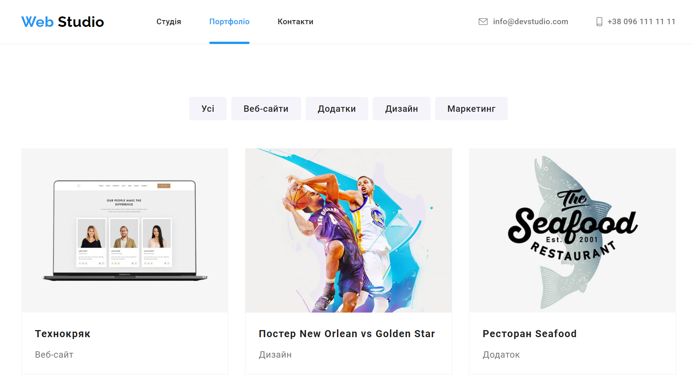
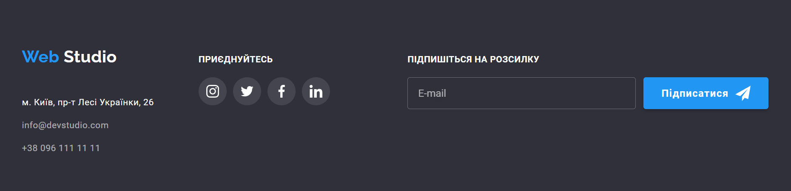

# [WebStudio](https://stanislavzhuk.github.io/WebStudio/)

The WebStudio site offers a simple and elegant design, contains several pages, and a modal window that enhances user interaction. It features a modern design, easy navigation, and excellent response speed for viewing on different devices.

## Home page

- The navigation menu allows users to easily move between the pages of the site.
- Key advantages of the company are specified. Each feature is accompanied by an icon and a short description.
- Demonstrated examples of services provided by the studio.
- Featured team including photos, names and positions of each member. Social media links are provided for each team member.
- Regular customers of the company are indicated, using their logos.

## Portfolio page

- On the "Portfolio" page there are examples of the studio's work.
- Added a handy filter to quickly find projects by category.

## Contacts

- The contacts block contains all the necessary information for contacting the studio and links to the company's pages in social networks, as well as subscription to the newsletter of the latest news and updates from the studio.

## Technologies

## Contact Us

If you have any questions, suggestions, or need assistance, feel free to contact our support team at stanislavzhuk.dev@gmail.com.